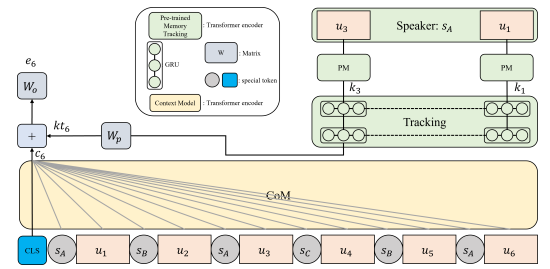

## 💡프로젝트 소개

#### 1️⃣ 주제 : 대화속 감정인식<br>
#### 2️⃣ 설명 : [CoMPM 논문](https://arxiv.org/pdf/2108.11626v3.pdf)을 기반으로 ERC 모델을 구현<br> 
#### 3️⃣ 모델 : Hugging Face [roberta-base](https://huggingface.co/roberta-base) 모델 사용하여 진행<br><br>

## CoMPM 논문 소개
#### CoM(context module) : 입력으로는 대화의 발화들이 전부 들어간다.
#### PM(pre-trained memory module) : CSK와 같이 context-independent발화의 feature을 담아내기 위함이다. <br><br>


<Br><br>
### 부연설명
- 각 발화의 feature는 CLS vector로 추출한다. 
- 이 vector를 GRU를 이용하여 하나의 vector로 만든다.
- Attention-based 결합은 성능이 떨어진다.
- speaker tracking만 한다.
- Listener tracking는 큰 효과가 없다.
- CoM과 PM의 feature vector의 dimension이 다르면 Wp을 이용하여 맞춰준다.

---
## 1. Train 

```
!pip install transformers==4.25.1
!pip install sklearn

!python3 train.py
```

## 2. Test
```
import torch
from dataset import data_loader
from torch.utils.data import DataLoader

test_dataset = data_loader('./data/test_sent_emo.csv')
test_dataloader = DataLoader(test_dataset, batch_size=1, shuffle=False, num_workers=4, collate_fn=test_dataset.collate_fn)

from model import ERC_model
clsNum = len(test_dataset.emoList)
erc_model = ERC_model(clsNum).cuda()
model_path = './model.bin'
erc_model.load_state_dict(torch.load(model_path))
erc_model.eval()
print('')
```

---
## 🗓️ 프로젝트 개선 진행

|개선 서비스|진행사항(%)|
|:----------:|:------:|
|speaker 구분||
|CLS 토큰 위치변경 ||
|special token으로 예측할 발화 추가||
|도메인 적응||
|감정간의 상관관계 고려||
|논문 참고하여 모델 개선||


---
